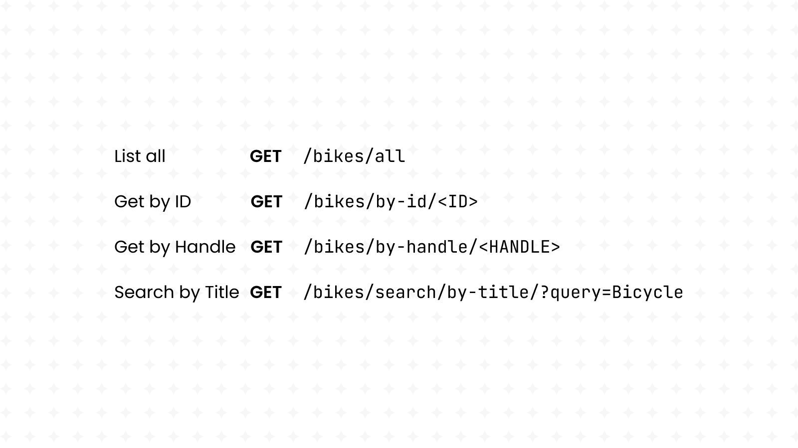
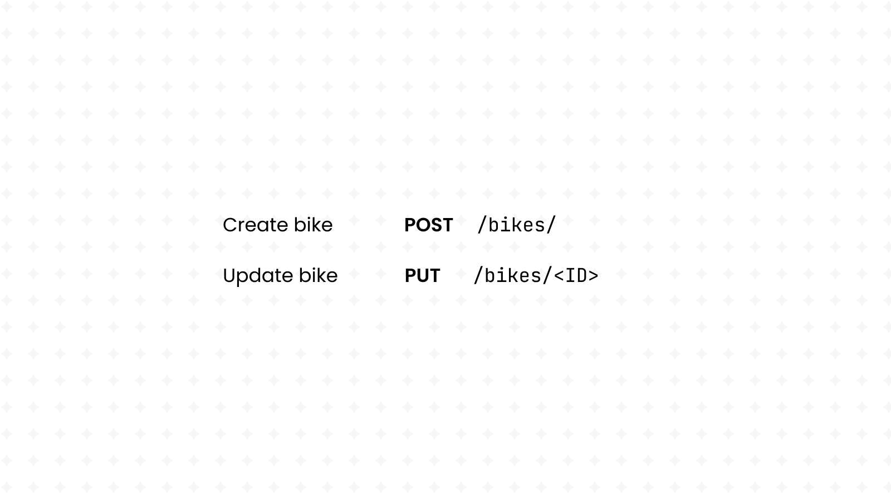
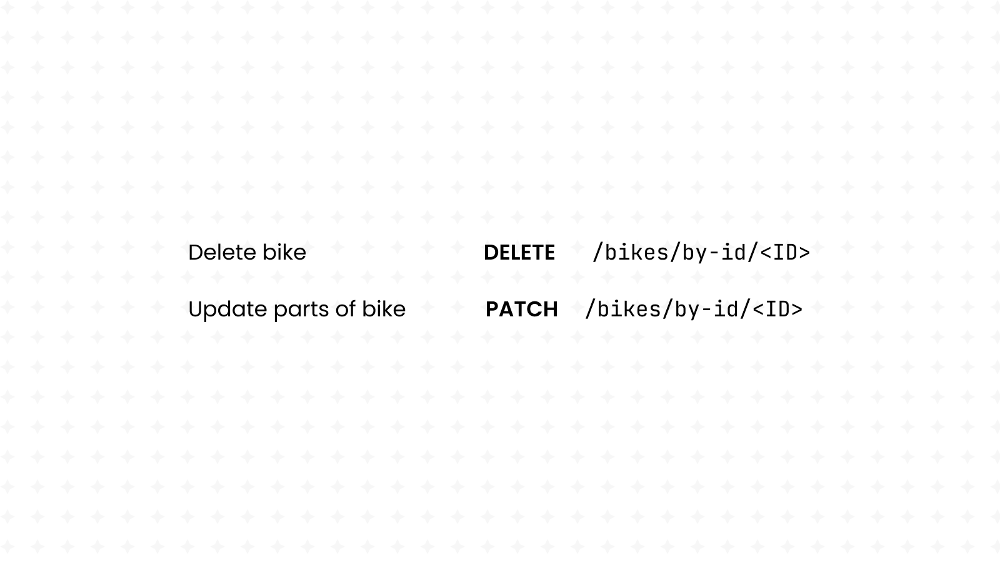
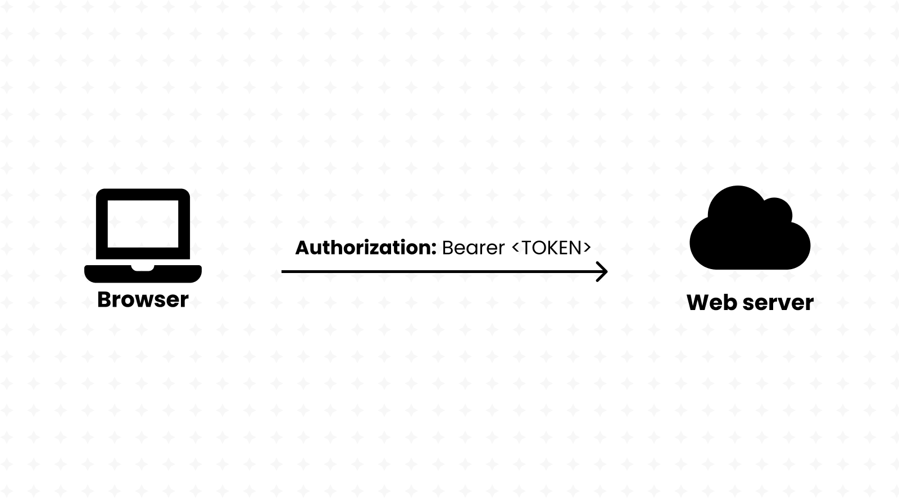
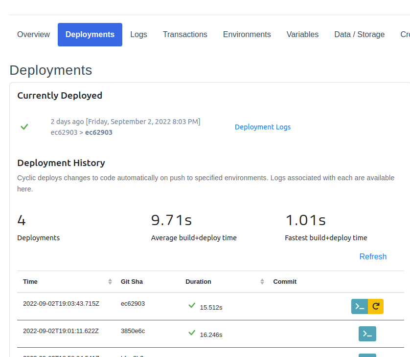

# Building a Bikes E-Commerce REST API using Express and AWS DynamoDB

This tutorial will show you how to build an API using Node’s Express and AWS DynamoDB.

We’ll build an API that simply reads and writes data about bikes, a perfect start for an e-commerce shop. We’ll also be using Cyclic to host our API for free, including the DynamoDB storage.

You can check out this project's [full code on GitHub](https://github.com/eludadev/bikes-api) if you ever get lost.

But before we start with the coding, let's start with a description of *what* servers and APIs really are.

## A quick refresher on server-side programming

### How servers power the Internet


Before we delve deeper into RESTful APIs, let’s start from its origins and make sure that we all agree on what a *web server* is.

From a hardware point-of-view, a web **server** is a physical computer that stores and ***serves*** data over the Internet, and that includes everything from HTML documents, CSS stylesheets, images and video files.

Furthermore, every web server must run an HTTP server. That’s a piece of software that takes-in URLs and processes them to deliver content back to the end-users, while using the HTTP protocol to facilitate the sharing of information over the Internet.

> And if the URL is wrong, the server will generate a response with the infamous 404 code instead.
> 

### Servers communicate with browsers using the HTTP protocol

When you search for a product, view details on it or even buy it, an **HTTP request** is sent to a web server.

HTTP is a web standard that allows *any* server to know what to expect when it receives an *HTTP request*:

- a URL linking to the resource,
- request parameters defined in the query string, (like `google.com/?q=my%20search`)
- a method defining the desired action, (whether to get, create or delete that resource)
- JSON data encoded in the request body or in associated cookies.

HTTP servers proceed by processing the request, then sending an *HTTP response* back to the sender. The response includes a *status line* indicating the result of that operation. Success for example, is represented with the `HTTP/1.1 200 OK` code. Unavailable resources would instead respond with the `HTTP/1.1 404 NOT FOUND` code.

And just like any other resource, *static websites* are just HTML files hosted on web servers. (with a hint of CSS files, JS files and other media)

---

Sounds good, we just learnt that servers are the building-blocks of the Internet, and that they’re responsible for storing *static* resources and serving them back to the users of the Internet.

But what about websites that are always changing? Think Walmart, for example. It’s an online store that’s constantly changing:

- adding new products,
- tracking how many articles of an item are in-stock,
- and storing private user-specific data, such as shopping carts.

These kinds of websites, which may even be categorized as full-fledged applications, are usually using an **API** (Application Programming Interface) behind the scenes.

Instead of delivering whole HTML files, APIs *only* return useful information (usually in JSON format) that may be used to build a website. For instance, the Walmart API may have one URL for retrieving the list of items in display:

```json
[
	{
		"name": "Oranges",
		"inStock": 8,
		"description": "..."
	},
	{
		"name": "Table",
		"inStock": 0,
		"description": "..."
	}
]
```

It may fetch this data from a database that’s maintained by an entirely different department in Walmart. The sender of the HTTP request, then, can solely focus on using this information to build a website and show it to the end-user.

Web servers are critical in the creation of APIs that rely on **dynamic** data:

- they efficiently deliver tailored-made recommendations to your users,
- they power dynamic search results and e-commerce products inventory,
- and they give control access to private user information.

With this kind of separation, our website can use JavaScript to fetch data from our API and then use a client-side framework such as React to build the end-user interface.

Furthermore, server-side code can be written in a variety of programming languages, including but not limited to PHP, Python, Ruby, and C#. But why stray away from the same language that we already use in client-side programming?

With Node, we’re able to write our back-end code in JavaScript, giving us full access to the server operating system. (storage, networking, scheduling, and more.) It runs directly in the server operating system, while adding new modules including HTTP and file-system libraries.

When both the front-end and back-end sides of an application are written in the same language, developers experience less of “context shift”, making it ideal for large-scale projects.

```javascript
// Example of a web server written in Node 

const http = require('http');
const fs = require('fs');
const path = require('path');

http
  .createServer((request, response) => {
    console.log(`request ${request.url}`);

    let filePath = `.${request.url}`;
    if (filePath === './') {
      filePath = './index.html';
    }

    const extname = String(path.extname(filePath)).toLowerCase();
    const mimeTypes = {
      '.html': 'text/html',
      '.js': 'text/javascript',
      '.css': 'text/css'
    };

    const contentType = mimeTypes[extname] ?? 'application/octet-stream';

    fs.readFile(filePath, (error, content) => {
      if (error) {
        if (error.code === 'ENOENT') {
          fs.readFile('./404.html', (error, content) => {
            response.writeHead(404, { 'Content-Type': 'text/html' });
            response.end(content, 'utf-8');
          });
        } else {
// ... and much more code!
```

But [writing your own server](https://developer.mozilla.org/en-US/docs/Learn/Server-side/Node_server_without_framework) in Node itself isn’t very practical. Many tasks such as handling different HTTP verbs (like GET and POST) for the same route aren’t supported in Node by default, meaning that you’d have to reinvent the wheel by making your own web framework!

```javascript
// Example of web server written with Express! (much easier!)

const express = require('express')
const app = express()
const port = 3000

app.get('/', (req, res) => {
  res.send('Hello World!')
})

app.listen(port, () => {
  console.log(`Example app listening on port ${port}`)
})
```

Thankfully, Node comes with its own package manager, giving us access to a plethora of community-made modules. One of those modules is Express, the most popular Node web framework. It comes with a variety of features out of the box:

- Handling requests for the same URL with different HTTP verbs,
- Parsing JSON data straight from HTTP requests,
- Reading query data straight from HTTP requests,
- Running “middleware” for any routes before handling the requests. (Useful for authentication)

Express also comes with its own bundle of community-made middleware to handle all kinds of necessities such as parsing cookies and security headers. We’ll be using Express in the remainder of this tutorial.

### Let’s understand RESTful APIs


Server-side programmers have the ability to build their APIs however they want. That’s the freedom that Node and Express give you:

- you get to name your own routes,
- you get to handle different HTTP verbs in any way you want,
- and you even get to format the responses in whichever way you desire.

But with all this freedom comes a problem: we want all APIs to be unified under one standard; one way of formatting routes; one way of handling HTTP verbs; and one way of sending responses.

That’s where REST comes in; it stands for “R**epresentational State Transfer**” and defines a universal standard for building APIs.

REST recommends building your API around database(s), where each URL links in one way or another to one or more resources in that database.

REST calls for the use of the following HTTP verbs:

- **GET** is for fetching the resource.
- **POST** is for creating the resource.
- **DELETE** is for deleting the resource.
- **PUT** is for updating the whole resource.
- **PATCH** is for updating parts of the resource.

> It’s important that **GET** requests (also known as [“Safe methods”](https://developer.mozilla.org/en-US/docs/Glossary/Safe/HTTP)) do not change anything about the database.
> 

RESTful APIs handle routes in an “****[Idempotent](https://restfulapi.net/idempotent-rest-apis/)”** manner, meaning that making the same request multiple times yields the same result. They must also be [stateless](https://www.restapitutorial.com/lessons/whatisrest.html#), meaning that all necessary data to handle the request is contained within the request itself and not remembered from a previous request. This makes RESTful APIs much more scalable than their counterparts.

Sounds good, but how does one go about accessing an API? Well, since it’s just URLs, you might guess that your web browser is the perfect candidate. But if you try that out, you’ll soon realize that browsers are not very good at creating custom HTTP requests. Browsers only allow sending GET requests to specific URLs using the search bar, so they’re not very good for our purposes.

So what should we use instead? The answer is `cURL`, a Linux command that comes pre-installed on most modern distributions. With `cURL`, we can customize our HTTP requests however we like. We can type-in our own POST data, make DELETE requests and add our own HTTP headers. There’s no limit to the freedom provided by `cURL`.


Let’s demonstrate `cURL` by using it on the REST API that we’ll be making in this tutorial.

For starters, it’s incredibly easy to make GET requests:

```bash
curl https://bikes.cyclic.app/bikes/all
```


It’s also more convenient to use `cURL` with another command-line utility called `jq`. After [installing it on your own machine](https://stedolan.github.io/jq/download/), run the following:

```bash
curl https://bikes.cyclic.app/bikes/all | jq .
```


Then, we can add Query Strings to our request to access the API’s search feature, which we’ll soon build ourselves:

```bash
curl "https://bikes.cyclic.app/bikes/search/by-title/?query=Mountain" | jq .
```

We can also make make POST requests to our API using `cURL`; let’s create a new bike item.

```json
// request.json
{
  "productType": "Mountain Bicycle",
  "createdAt": "Sat Jun 27 2076 09:24:47 GMT+0100 (GMT+02:00)",
  "vendor": "Fiat",
  "totalInventory": 5,
  "availableForSale": false,
  "priceRange": {
    "minPrice": {
      "currencyCode": "USD",
      "amount": 2043
    },
    "maxPrice": {
      "currencyCode": "USD",
      "amount": 2303
    }
  },
  "description": "A omnis deserunt deleniti voluptas tenetur autem. Qui consequuntur omnis ut cupiditate. Fugiat id nihil ratione praesentium totam praesentium.",
  "title": "Mountain Bicycle Countach"
}
```

```bash
curl -H "Content-Type: application/json" https://bikes.cyclic.app/bikes/ -d @request.json
```


Uh-oh, we just got an HTTP `UNAUTHORIZED` error. After looking-up the meaning of [HTTP status codes](https://developer.mozilla.org/en-US/docs/Web/HTTP/Status), we see that  “UNAUTHORIZED” means that we do not have access to that particular route, yet. (and of course, we’ll be building this authentication system ourselves in this article)

After looking up our [API’s documentation on GitHub](https://github.com/eludadev/bikes-api), we learn that a “Bearer token” is required to make POST requests. (among other actions) 


We also learn that in order to create a Bearer token, we must send a POST request to the following route. And this one does not require authentication:

```bash
curl -X POST https://bikes.cyclic.app/api/user | jq .token -r
```


Let’s try making our request again. Bearer tokens go into the “Authorization” header of the HTTP request and must be formatted in this manner: “`Bearer <TOKEN>`”. Let’s do that in `cURL`:

```bash
export TOKEN=...
curl -H "Content-Type: application/json" -H "Authorization: Bearer $TOKEN" https://bikes.cyclic.app/bikes/ -d @request.json | jq .
```

As you can see, `cURL` is pretty powerful and we’ll be using it again and again throughout this guide.

### Using AWS DynamoDB to store & retrieve data


As we just said, RESTful APIs are built around databases. But *what* really is a database?

Well, a database is a set of inter-connected collections of information. For example, a database may contain a collection of users and a collection of products. Users and products may be connected through shopping carts. (Product A exists in User B’s shopping cart)

Some databases require every collection to have a fixed-set of data-points. For example, a user might have a name, a phone number and an email address. That would be the constraint in a **schema**-enabled database. Collections might also be seen as tables in this case, with a fixed number of columns that have their own data-type. (such as text, integer, booleans, and more)

On the other hand, schema-less databases have no such limitation. Each item in a collection is a JSON document, and it can have any structure desired. Such databases are also referred to as noSQL databases, while their counterparts are known as SQL databases. A user, for example, might have the following entry in a noSQL database:

```json
{
	"name": "John Doe",
	"isActive": true,
	"email": "example@domain.tld"
}
```

SQL is a language used for processing schema-enabled databases. It allows for the efficient searching and processing of information even on the biggest databases out there.

But with DynamoDB, a noSQL database engineered by Amazon’s Web Services (AWS), you still get to enjoy almost the whole power of SQL whilst feeling the freedom that comes with schema-less databases. It’s called [PartiQL](https://partiql.org/).

We’re building a bikes shop API, so our database should contain a collection of bikes. It’s a mix of Strings, Numbers and whole Objects.

Keep reading to see how we’ll be shaping our API around this database.

## Getting started with a RESTful API

**Requirements:**

- Node (16+)
- NPM (8+)
- cURL (7+)

and it won’t hurt to take a quick refresher on ES6 JavaScript programming.

We just spent a lot of time trying to understand REST in theory, but nothing can beat learning by practice. So let’s create our own API. Our theme is a bikes shop, so that’s how we’ll be modelling our RESTful routes.

Cyclic offers its users with a variety of starter templates, and REST APIs are included, of course. So let’s begin our exciting journey by visiting [Cyclic’s starters](https://app.cyclic.sh/#/deploy) and deploying the [Database API](https://app.cyclic.sh/#/deploy).

This will fork the respective starter repository to your own Github account (that you signed in with).

[](https://app.cyclic.sh/#/deploy)

Proceed by cloning the repository to your local machine using the `git clone` command, which you can copy from Github. Make sure that `git` is installed on your machine, of course.

We’ll be using ECMA6 import and export statement in this project, so open `package.json` and set the project’s type to “module”. 

```json
// package.json

{
	"type": "module"
}
```

Let’s also replace Cyclic’s starter code with `import`s. But that’s a matter of preference and you can keep it however you like. (if you decide to keep the `require`s, revert the last change that was made to `"type"` in `package.json`.)

```javascript
import express from "express";
import db from "cyclic-dynamodb";
```

[Link to full code.](https://github.com/eludadev/bikes-api/blob/main/index.js)


And since we’re building our API around our a DynamoDB database, we need to make sure that we have read and write access to it by exporting the keys provided by Cyclic’s “**Data/Storage**” dashboard to our local machine. (do this every time you launch the terminal)

Cyclic does this automatically for us in production-mode, however. So we don’t need to worry about this task when deploying our API.

Remember when we mentioned Node’s package manager (NPM) that we used to get access to Express? Well, GitHub repositories that use NPM only contain the *names* and *versions* of used packages, but not the actual packages themselves.

Whenever we clone a GitHub repository, we must run `npm install` to actually *download* those packages into our machine. 

## Our database is empty… let’s create some mock data


Everything’s going great, it’s time to get started building our database!

First of all, every AWS DynamoDB instance has a specific name, also known as a *table name*. It’s given to us by Cyclic in its database dashboard page.


Let’s copy that value into the `.env.sample` file and remove the `BUCKET` variable. Such a file contains environment variables that must be registered before running our server. It won’t work until we copy it into a `.env` file, however:

[Learn more about environment variables.](https://www.freecodecamp.org/news/what-are-environment-variables-and-how-can-i-use-them-with-gatsby-and-netlify/)

```bash
cp env.sample .env
```

> The database credentials that we copied into our machine are themselves environment variables. However, we didn’t copy them into our `.env` file since they’re only temporary for our local development, and Cyclic will change them once deployed on the Internet.
The table name, however, is static and won’t change; it’s safe to put it in the `.env` file.
> 

After doing that, we can start our REST API by running `npm run dev`.

Let’s make sure that our *local* server is up and running by debugging it using cURL:

```bash
curl http://localhost:3000/animals/rin%20tin%20tin \
    --data '{"breed":"German Shepard", "gender": "male"}' \
    -XPOST -H 'Content-Type: application/json'| jq .
```

As you can see, *local* servers are hosted on the [`localhost`](http://localhost) domain or [`127.0.0.1`](http://127.0.0.1) IP address. It’s also common to see them running on the `3000` port, as being done in this server. (`8000`, `8080`, `5000` are also equally as common) 

[Learn more about local hosting and ports.](https://developer.mozilla.org/en-US/docs/Learn/Common_questions/set_up_a_local_testing_server)

---

Our database is currently empty, and it’s not very convenient to create API routes that fetch data when… well, there’s no data to fetch! That would make it nearly impossible to debug our RESTful API.

Therefore, for the purposes of this tutorial, you can run the following script that generates some mock data to fill your database. Create a new file called `fill-db.js` and copy the contents of this script into it:

```javascript
import DynamoDb from "cyclic-dynamodb";

import slugify from "slugify";
import { v4 as uuidv4 } from "uuid";
import { faker } from "@faker-js/faker";

export const bikeAccessor = () => {
  const type = faker.vehicle.bicycle();

  const title = type + " " + faker.vehicle.model();
  const handle = slugify(title).toLocaleLowerCase();

  const minPrice = faker.datatype.number({
    min: 800,
    max: 3000,
  });
  const maxPrice = faker.datatype.number({
    min: minPrice,
    max: minPrice * 2,
  });

  return {
    id: uuidv4(),
    title,
    handle,
    productType: type,
    createdAt: String(faker.datatype.datetime()),
    description: faker.lorem.paragraph(),
    vendor: faker.vehicle.manufacturer(),
    availableForSale: faker.datatype.boolean(),
    totalInventory: faker.datatype.number({ min: 1, max: 5 }),
    priceRange: {
      minPrice: {
        amount: minPrice,
        currencyCode: "USD",
      },
      maxPrice: {
        amount: maxPrice,
        currencyCode: "USD",
      },
    },
  };
};

async function fillDataBaseWithBikes() {
  const totalBikes = 25;
  const randomBikes = Array(totalBikes).fill({}).map(bikeAccessor);

  const db = DynamoDb(process.env.DYNAMO_DB);
  const bikesCollection = db.collection("bikes");

  let i = 1;
  for (const bike of randomBikes) {
    console.log(`Adding bike ${i}/${totalBikes}...`);
    await bikesCollection.set(bike.id, bike);

    i++;
  }
}

fillDataBaseWithBikes();
```

[Link to full code.](https://github.com/eludadev/bikes-api/blob/main/fill-db.js)

Don’t worry if you don’t understand what this script is doing; we’ll be going over all its intricate parts in the rest of this tutorial. Run the following commands to execute this script: 

```bash
npm install slugify uuid @faker-js/faker runtypes jsonwebtoken
npx env-cmd node fill-db.js
```

As you can see, it added 25 bike items to our database. Let’s see how to fetch all this data in the next section of this guide.

> **NOTE:** if you encounter an “`ExpiredToken`” error, just refresh Cyclic’s page and `export` the new credentials.
> 

## Creating routes to fetch and search data



With our database full with data, it's time to build a RESTful API that allows us to fetch that data in four different ways:

1. GET all bikes
2. GET bike by ID
3. GET bike by handle
4. GET bikes by search query

Get started by creating a `router.js` file. This file will contain and export an Express **Router (**the entity that handles URLs with different HTTP verbs), processes them, and returns a response. This entire process is customizable by us, the programmers of the HTTP server.

```javascript
// router.js

import { Router } from "express";

// Initialize Express router
export const router = Router();
```

[Link to full code.](https://github.com/eludadev/bikes-api/blob/main/router.js)

We can now use the `router` object to define a variety of HTTP request handlers for this server. But to make it work, we must attach it to the `index.js` file, which is executed by Cyclic when the server is first started using `npm run dev`:

```javascript
// index.js

import { router as bikesRouter } from "./router.js"; // this is the new import

import express from "express";

const app = express();

app.use(express.json());
app.use(express.urlencoded({ extended: true }));

app.use("/bikes", bikesRouter); // this is the new line

const port = process.env.PORT || 3000;
app.listen(port, () => {
  console.log(`Listening on port ${port}`);
});

// delete all other lines after this
```

[Link to full code.](https://github.com/eludadev/bikes-api/blob/main/index.js)

This implies that all URL paths that begin with `/bikes` will be handled by the router defined in the `router.js` script. (e.g `/bikes/all`, `/bikes/by-id`, …)

### Fetching all bikes

Our very first route handler is pretty simple: it’s a handler for the `/bikes/all` URL with the GET action, always returning a list of *all* bikes in the database.

> In large APIs that depend on huge databases (such as Instagram and Twitter), it’s common to see the API supporting [pagination](https://developer.atlassian.com/server/confluence/pagination-in-the-rest-api/), a feature that allows the API’s users to only fetch part of the database, since it’s nearly impossible to return a list of 1,000,000 items in one HTTP response, for example.
> 

We haven’t created a route handler, yet. Thankfully, all of them generally follow the same pattern:

```javascript
router.get("/all", async (req, res) => {
  res.send([]);
});
```

[Link to full code.](https://github.com/eludadev/bikes-api/blob/main/router.js)

As you can see, we’re telling Express to handle the GET action on the `/all` route by running the `router.get` method. If we wished to support the POST action instead for example, we would do `router.post`, as we’ll do in the next section of this guide.

Route handlers also take a [callback function](https://developer.mozilla.org/en-US/docs/Glossary/Callback_function) as their second parameter; that’s a function that takes two parameters itself:

- **HTTP Request:** as the first parameter passed to this function (which we conveniently named `req`), it’s an object that contains all kinds of information about the HTTP request including but not limited to the query strings, body data and even HTTP headers.
- **HTTP Response:** this is the second parameter, and it’s used to fill the HTTP response with some information before sending it back to the client using the `res.send` method. For now, we’re simply returning an empty `Array`, but we’ll soon populate it with bikes data.

And notice how we’re using an [asynchronous function](https://developer.mozilla.org/en-US/docs/Web/JavaScript/Reference/Statements/async_function) as the callback. While not required, it’s important to note that it’s well-supported with Express and we’ll be using it to wait for DynamoDB to return its data. Of course, we could also use [Promises](https://developer.mozilla.org/en-US/docs/Web/JavaScript/Guide/Using_promises) instead.

And now, of course, we must make calls to our DynamoDB instance to actually fetch some data. Let’s get started by creating an instance of our bikes collection, giving us access to a variety of methods for manipulating our database:

```javascript
// Initialize AWS DynamoDB
const db = DynamoDb(process.env.CYCLIC_DB);
const bikesCollection = db.collection("bikes");
```

[Link to full code.](https://github.com/eludadev/bikes-api/blob/main/router.js)

As you can see, we’re using the `cyclic-dynamodb` library to create a programmable instance of our database. That’s a convenience library used to facilitate the communication with our database using simple JavaScript code. We’re also extracting the `CYCLIC_DB` environment variable that we set earlier using `process.env`. 

> The `process.env` object itself was populated with values from the `.env` file when we called the `env-cmd` command that runs with the `dev` script from `package.json`: `env-cmd nodemon index.js`
> 

Let’s move back into our route handler to finally make some use of this`bikesCollection` object:

```javascript
// Get all bikes
router.get("/all", async (req, res) => {
  const { results: bikesMetadata } = await bikesCollection.list();

  const bikes = await Promise.all(
    bikesMetadata.map(async ({ key }) => (await bikesCollection.get(key)).props)
  );

  res.send(bikes);
});
```

[Link to full code.](https://github.com/eludadev/bikes-api/blob/main/router.js)

Let’s dissect the above code snippet line-by-line:

1. We’re calling the asynchronous `list()` method that returns an object containing the results field. Being the only interesting field, we’re directly extracting it using JavaScript [Destructing Assignment](https://developer.mozilla.org/en-US/docs/Web/JavaScript/Reference/Operators/Destructuring_assignment) and renaming it to `bikesMetadata`. This final object, however, does not contain the bike’s data; it’s only giving us the IDs (or “Keys”) of those bikes.
    
    ```javascript
    const { results: bikesMetadata } = await bikesCollection.list();
    // bikesMetadata = [
    // { key: '...' },
    // { key: '...' },
    // ]
    ```
    
2. We’re iterating over every bike key and using the asynchronous `get()` method to fetch the *actual* bike data, stored in the props field. The result is an array of Promises, which we await to all be resolved using the `Promise.all` method.
    
    ```javascript
    const bikes = await Promise.all(
      bikesMetadata.map(
        async ({ key }) =>
          (
            await bikesCollection.get(key)
          ).props // { props: { ... } }
      ) // { title, inStock, ... } (actually a Promise!)
    );
    ```
    
3. We’re finally sending an array of bike data back in the HTTP response. 

All looking good! Since our server is automatically restarted when we change our code (a consequence of running [`nodemon`](https://www.npmjs.com/package/nodemon)), we can directly go debug it using `cURL`:

```bash
curl http://localhost:3000/bikes/all | jq .
```

### Fetching a bike by ID

We just figured out how to fetch a full list of bikes using DynamoDB, and within that piece of code, we nested a little snippet that fetched a bike using its ID (or key):

```javascript
await bikesCollection.get(key).props;
```

We’ll be using that command to build the remainder of this route. But first of all, it’s important to first model our URL. Since our API follows the REST standard, it’s best practice to name it like the following: `/by-id/<ID>`. As you can see, the ID is encoded directly in the URL itself, so how do we use Express to extract this specific part of the URL?

The answer is relatively simple: when using Express, all we have to do is simply replace the dynamic part of the URL with a colon and a name for it.

```javascript
// Get bike by ID
router.get("/by-id/:id", async (req, res) => {
  const id = req.params.id;
});
```

[Link to full code.](https://github.com/eludadev/bikes-api/blob/main/router.js)

As you can see, we’re inserting `:id` into our URL and proceed to extract it from the `req.params` object.

With the ID now in our hands, we can use that code snippet we just saw to extract specific data from DynamoDB:

```javascript
// Get bike by ID
router.get("/by-id/:id", async (req, res) => {
  const id = req.params.id;

  const { props: bike } = await bikesCollection.get(id);
  res.send(bike);
});
```

Link to full code.

Let’s test that:

```bash
curl http://localhost:3000/bikes/by-id/<ID> | jq . # replace <ID> with an ID from the response to /all
```

But what if the item with that ID doesn’t exist? In that case, we wish to return an HTTP response with the 404 status code, indicating that the resource does not exist.

```javascript
// Get bike by ID
router.get("/by-id/:id", async (req, res) => {
  const id = req.params.id;

  try {
    const { props: bike } = await bikesCollection.get(id);
    res.send(bike);
  } catch (e) {
    console.log(`GET /by-id/${id}`, e.message);
    res.sendStatus(404);
  }
});
```

[Link to full code.](https://github.com/eludadev/bikes-api/blob/main/router.js)

Let’s see if that works: 

```bash
curl http://localhost:3000/bikes/by-id/blahblah
```

### Fetching a bike by handle

Okay, so we’re using IDs to index our bike items. But they’re just a random mix of numbers and letters, designed so that they generate a unique ID per item.

The alternative is “handles”, [slugified](https://developer.mozilla.org/en-US/docs/Glossary/Slug) versions of the title that are still unique.

Let’s extract them from the route:

```javascript
// Get bike by handle
router.get("/by-handle/:handle", async (req, res) => {
  const handle = req.params.handle;
});
```

[Link to full code.](https://github.com/eludadev/bikes-api/blob/main/router.js)

We can’t just run the `get()` method this time, since we don’t have the item’s key.

One thing we could do, of course, is to get a list of every bike item and check the handle of each one. That, however, is not very efficient.

Thankfully, whilst DynamoDB is a schemaless noSQL database, it still supports a variety of SQL-like powerful features collectively called [PartiQL](https://partiql.org/). We can use Cyclic’s DynamoDB object to **filter** the bike items and only keep the ones that match our handle, and there should of course be either only one or none at all.

```javascript
const { results } = await bikesCollection.filter({ handle });
```

This method, unlike `list()`, returns the full data for each found item. Let’s extract our bike’s data and send it back to the client:

```javascript
// Get bike by handle
router.get("/by-handle/:handle", async (req, res) => {
  const handle = req.params.handle;

  const { results } = await bikesCollection.filter({ handle });
  const { props: bike } = results[0];

  res.send(bike);
});
```

[Link to full code.](https://github.com/eludadev/bikes-api/blob/main/router.js)

And let’s not forget to do some error handling, in case no bike object matches that particular handle. That’s tested checking the truthiness of `results.length`, returning `False` when it’s an empty array.

```javascript
// Get bike by handle
router.get("/by-handle/:handle", async (req, res) => {
  const handle = req.params.handle;

  try {
    const { results } = await bikesCollection.filter({ handle });
    if (!results.length) throw new Error();

    const { props: bike } = results[0];
    res.send(bike);
  } catch (e) {
    console.log(`GET /bikes/by-handle/${handle}`, e.message);
    res.sendStatus(404);
  }
});
```

[Link to full code.](https://github.com/eludadev/bikes-api/blob/main/router.js)

And of course, we should always battle-test our API before shipping it to the Internet:

```bash
curl http://localhost:3000/bikes/by-handle/<HANDLE> | jq . # replace <HANDLE> with a handle from the response to /all
```

### Fetching bikes by search on title

Search is one of the most important features in a website. It’s how users discover new products without having to browse a list of hundreds or even thousands of items. Implementing it, however, is not so simple.

The most popular search engines have to take a plethora of things into account: ignoring pronouns, ignoring uppercase characters, handling misspelled words, etc…

In fact, DynamoDB comes with full support for [ElasticSearch](https://aws.amazon.com/about-aws/whats-new/2015/08/amazon-dynamodb-elasticsearch-integration/), a powerful search engine developed  used by some of the biggest applications out there.

But for the purposes of this tutorial, we’ll stick with something more simple. DynamoDB also supports scans: SQL-like querying that handles many powerful [expressions](https://docs.aws.amazon.com/cli/latest/reference/dynamodb/scan.html).

Scans take-in expressions, powerful combinations of built-in commands, such as **`contains`**. That’s a command that facilitates the ability to check whether one of an item’s fields *contains* a string of characters. Unfortunately, it does not support any advanced search-like features such as ignoring uppercase or lowercase characters, but it’s useful enough for a simple application.

But before we delve deeper into DynamoDB Scans, let’s write the fundamentals of our new router.

We’ll be using query strings this time, also called GET parameters.

They simply are key-value pairs encoded in the right-hand side of a URL in the following manner: `/bikes/search/by-title?term=<QUERY>` (in this case, “term” is the GET parameter with the value  `<TERM>`)

```javascript
// Search bikes by title
router.get("/search/by-title", async (req, res) => {
  const term = req.query.term || "";
});
```

[Link to full code.](https://github.com/eludadev/bikes-api/blob/main/router.js)

Let’s proceed now by using this search term to look-up some data. The function that we’re looking for is `parallel_scan`, taking the expression `contains(title, <TERM>)`. However, we must split this expression into its three parts:

1. **The expression itself:** `contains()`
2. **The attribute name:** `title`
3. **The attribute value:** `<TERM>`

We can combine these 3 parts into one by replacing the attribute name with `#title` and its value with `:value`, we can then replace these placeholders with the real values:

```javascript
const { results } = await bikesCollection.parallel_scan({
  expression: "contains(#title, :title)",
  attr_names: {
    "#title": "title",
  },
  attr_vals: {
    ":title": query,
  },
});
```

[Link to full code.](https://github.com/eludadev/bikes-api/blob/main/router.js)

Let’s see how that fits into the router code:

```javascript
// Search bikes by title
router.get("/search/by-title", async (req, res) => {
  const query = req.query.query || "";

  const { results } = await bikesCollection.parallel_scan({
    expression: "contains(#title, :title)",
    attr_names: {
      "#title": "title",
    },
    attr_vals: {
      ":title": query,
    },
  });

  const bikes = results.map(({ props }) => props);
  res.send(bikes);
});
```

[Link to full code.](https://github.com/eludadev/bikes-api/blob/main/router.js)

And with the same error handling, it’s even more robust:

```javascript
// Search bikes by title
router.get("/search/by-title", async (req, res) => {
  const query = req.query.query || "";

  try {
    const { results } = await bikesCollection.parallel_scan({
      expression: "contains(#title, :title)",
      attr_names: {
        "#title": "title",
      },
      attr_vals: {
        ":title": query,
      },
    });

    const bikes = results.map(({ props }) => props);
    res.send(bikes);
  } catch (e) {
    console.log(`GET /bikes/search/by-title term="${query}"`, e.message);
    res.sendStatus(400);
  }
});
```

[Link to full code.](https://github.com/eludadev/bikes-api/blob/main/router.js)

Let’s try it out! Make a search with the term “Bicycle” (case-sensitive) and see the results:

```bash
curl http://localhost:3000/bikes/search/by-title\?query\=Bicycle | jq .
```

## Creating routes to create and replace data



Our API is now given the ability to fetch data in a variety of ways, but it wouldn’t be complete if we didn’t make for some way to create and replace new and existing items.

### Creating a new bike

Our RESTful API should have an endpoint that accepts bike data, with *all* of its fields except for the ID and handle, which will be both automatically generated within our server.

It’s worth noting that POST body data can be in a variety of data-types, hinted in the [`Accept`](https://developer.mozilla.org/en-US/docs/Web/HTTP/Headers/Accept) HTTP header. But having declared `app.use(express.json())` in our `index.js` file (it already came with the starter), we can directly access the body data in JSON format by extracting it from the `req.body` property.

```javascript
// Post new bike
router.post("/", authenticateUser, async (req, res) => {
  const bikeData = req.body;
});
```

[Link to full code.](https://github.com/eludadev/bikes-api/blob/main/router.js)

Then, it’s critical to validate this data. Instead of checking the existence of every field and its value, we can use [`runtypes`](https://www.npmjs.com/package/runtypes),  yet another library whose purpose is to conveniently check the fields of an object.

```javascript
import { Record, String, Number, Boolean } from "runtypes";

// Type for new bikes
const Money = Record({
  amount: Number,
  currencyCode: String,
});
const PriceRange = Record({
  minPrice: Money,
  maxPrice: Money,
});
const BikeData = Record({
  title: String,
  productType: String,
  createdAt: String,
  description: String,
  vendor: String,
  availableForSale: Boolean,
  totalInventory: Number,
  priceRange: PriceRange,
});
```

[Link to full code.](https://github.com/eludadev/bikes-api/blob/main/router.js)

We can now check the validity of our data by calling one simple method:

```javascript
// Create new bike
router.post("/", async (req, res) => {
  const bikeId = req.params.id;
  const bikeData = req.body;

  try {
    // Make sure bike data exists
    if (!req.body) {
      throw new Error();
    }

    // Make sure bike data contains all required fields
    const bikeObject = BikeData.check(bikeData);
  } catch (e) {
    console.log(`POST /bikes/`, e.message);
    res.sendStatus(400);
  }
});
```

[Link to full code.](https://github.com/eludadev/bikes-api/blob/main/router.js)

And before saving this data, we must generate its ID and handle. We’ll do the latter using [`uuid`](https://www.npmjs.com/package/uuid), a JavaScript library that generated `Universally Unique IDentifier`, which are guaranteed to be unique every time it’s run. The former, however, will be done using [`slugify`](https://www.npmjs.com/package/slugify), a function that strips text from spaces and replaces it with dashes instead: “Mountains Bike” ↦ “Mountains-Bike”.

```javascript
import slugify from "slugify";
import { v4 as uuidv4 } from "uuid";

// Generate ID and Handle for bike
const bikeId = uuidv4();
const bikeHandle = slugify(bikeObject.title).toLowerCase();

// Create full bike object
const bike = {
  ...bikeObject,
  id: bikeId,
  handle: bikeHandle,
};
```

[Link to full code.](https://github.com/eludadev/bikes-api/blob/main/router.js)

And the last step of course is to save this data and send it back to the client. This time, the client will receive a bike object with the ID and handle included:

```javascript
// Save bike object
await bikesCollection.set(bikeId, bike);

res.send(bike);
```

[Link to full code.](https://github.com/eludadev/bikes-api/blob/main/router.js)

Let’s try it out! We’ll use `cURL` and read `request.json` as body data by prefixing it with an @ symbol.

```json
// request.json (remove this line from the actual file!)
{
  "productType": "Hybrid Bicycle",
  "createdAt": "Fri Jan 28 2022 03:13:24 GMT+0100 (GMT+02:00)",
  "vendor": "Audi",
  "totalInventory": 2,
  "availableForSale": false,
  "priceRange": {
    "minPrice": {
      "currencyCode": "USD",
      "amount": 1160
    },
    "maxPrice": {
      "currencyCode": "USD",
      "amount": 1624
    }
  },
  "description": "Autem ipsam quasi omnis ut. Et officiis quia. Sed quaerat pariatur nihil nobis est quos earum quidem.",
  "title": "Hybrid Bicycle Sentra"
}
```

```bash
curl -H "Content-Type: application/json" http://localhost:3000/bikes/ -d @request.json | jq .
```

### Replacing a bike item

Another common RESTful API endpoint that we must implement is PUT, whose purpose is to replace a bike item instead of creating it. This time, the ID and handle will be already provided, so we don’t have to do much instead of validating the data.

```javascript
// Update entire bike
router.put("/by-id/:id", async (req, res) => {
  const bikeId = req.params.id;
  const bikeData = req.body;

  try {
    // Make sure bike data exists
    if (!req.body) {
      throw new Error();
    }

    // Make sure bike has ID and handle
    if (!bikeData.id || !bikeData.handle) {
      throw new Error();
    }

    // Make sure bike data contains all required fields
    const bikeObject = BikeData.check(bikeData);

    // Delete existing bike object
    await bikesCollection.delete(bikeId);

    // Save new bike object
    await bikesCollection.set(bikeId, bikeObject);

    res.send(bikeObject);
  } catch (e) {
    console.log(`PUT bikes/by-id/${bikeId}`, e.message);
    res.sendStatus(404);
  }
});
```

[Link to full code.](https://github.com/eludadev/bikes-api/blob/main/router.js)

What we’re doing here is first checking if the bike item exists by retrieving its ID, and we’re then validating the data, deleting the existing item and replacing it with a new item.

```json
// request.json (remove this line from the actual file!)
{
  "productType": "Hybrid Bicycle",
  "createdAt": "Fri Jan 28 2022 03:13:24 GMT+0100 (GMT+02:00)",
  "vendor": "Audi",
  "totalInventory": 2,
  "availableForSale": false,
  "priceRange": {
    "minPrice": {
      "currencyCode": "USD",
      "amount": 1160
    },
    "maxPrice": {
      "currencyCode": "USD",
      "amount": 1624
    }
  },
  "description": "Autem ipsam quasi omnis ut. Et officiis quia. Sed quaerat pariatur nihil nobis est quos earum quidem.",
  "title": "Hybrid Bicycle Sentra",
  "id": "4139c5ae-b83d-4a0c-9b75-12d182aaed7c",
  "handle": "hybrid-bicycle-sentra"
}
```

```bash
curl -X PUT -H "Content-Type: application/json" http://localhost:3000/bikes/by-id/<ID> -d @request.json | jq . # replace <ID> with an ID from the response to /all
```

## Finishing up with routes to update and delete data



We’re almost done; but we still must implement two more route handlers: PATCH and DELETE.

The former allows clients to update only *parts* of a bike item, as opposed to PUT which always replaces the whole thing. The latter is quite self-explanatory and it simply deletes the item in demand.

### Updating parts of a bike item

We’ll of course get started by extracting data from the HTTP request, as always:

```javascript
// Patch bike if it exists
router.patch("/by-id/:id", async (req, res) => {
  const bikeId = req.params.id;
  const newData = req.body || {};
});
```

[Link to full code.](https://github.com/eludadev/bikes-api/blob/main/router.js)

Next step is to check whether or not a bike item with this ID exists, before we update anything.

```javascript
// Patch bike if it exists
router.patch("/by-id/:id", async (req, res) => {
  const bikeId = req.params.id;
  const newData = req.body || {};

  try {
    const { props: oldBike } = await bikesCollection.get(bikeId);
  } catch (e) {
    console.log(`PATH /bikes/by-id/${bikeId}`, e.message);
    res.sendStatus(404);
  }
});
```

[Link to full code.](https://github.com/eludadev/bikes-api/blob/main/router.js)

After that, we may take advantage of DynamoDB’s [UpdateItem](https://docs.aws.amazon.com/amazondynamodb/latest/APIReference/API_UpdateItem.html) command to only replace parts of our bike item:

```javascript
// Save new bike object
await bikesCollection.set(bikeId, newData);
```

[Link to full code.](https://github.com/eludadev/bikes-api/blob/main/router.js)

Let’s finish up by sending the full bike object back to the client. We’ll take advantage of JavaScript [Spread Syntax](https://developer.mozilla.org/en-US/docs/Web/JavaScript/Reference/Operators/Spread_syntax) to create that object:

```javascript
const bike = {
  ...oldBike,
  ...newData,
};

res.send(bike);
```

[Link to full code.](https://github.com/eludadev/bikes-api/blob/main/router.js)

And again, let’s try it out:

```json
// request.json (remove this line from the actual file!)
{
  "totalInventory": 4,
  "availableForSale": true
}
```

```bash
curl -X PATCH -H "Content-Type: application/json" http://localhost:3000/bikes/by-id/<ID> -d @request.json | jq . # replace <ID> with an ID from the response to /all
```

### Deleting a bike item

It wouldn’t be a big stretch to say that this is the simplest route of the bunch.

First step is to get the ID from the route parameters:

```javascript
// Delete bike if it exists
router.delete("/by-id/:id", async (req, res) => {
  const bikeId = req.params.id;
});
```

[Link to full code.](https://github.com/eludadev/bikes-api/blob/main/router.js)

Following that, we quite simply call one function from Cyclic’s DynamoDB library and the job’s done!

```javascript
await bikesCollection.delete(bikeId);
```

[Link to full code.](https://github.com/eludadev/bikes-api/blob/main/router.js)

We’ll do some error handling too and return the deleted item’s ID back to the client:

```javascript
// Delete bike if it exists
router.delete("/by-id/:id", async (req, res) => {
  const bikeId = req.params.id;

  try {
    await bikesCollection.delete(bikeId);

    res.send({
      id: bikeId,
    });
  } catch (e) {
    console.log(`DELETE /bikes/by-id/${bikeId}`, e.message);
    res.sendStatus(404);
  }
});
```

[Link to full code.](https://github.com/eludadev/bikes-api/blob/main/router.js)

Let’s try deleting some data. Make sure to get the ID from your previous calls to `/bikes/all`:

```bash
curl -X DELETE http://localhost:3000/bikes/by-id/<ID> | jq . # replace <ID> with an ID from the response to /all
```

## Securing our database with authentication



Every public (and private) API must come with some sort of protection around its data. We don’t want to allow anyone in the world to play around with our important database.

And while there are various authentication methods out there, [Bearer](https://swagger.io/docs/specification/authentication/bearer-authentication/) is one of the simplest.

Its idea is quite simple: give users a token (they’re the *bearer* of that token), give that token some privileges (such as only reading or also writing and deleting) and finally require the use of that token when making [unsafe HTTP requests](https://developer.mozilla.org/en-US/docs/Glossary/Safe/HTTP).

We won’t be implementing privileges and roles to keep this guide simple, but we’ll be using Bearer authentication. Get started by installing the [`jsonwebtoken`](https://www.npmjs.com/package/jsonwebtoken) package; it’s an implementation of [JSON Web Tokens](https://jwt.io/), an standard for creating and checking credentials across the Internet.

After that, create an `auth.js` file, which will contain two important utilities for Bearer authentication.

The first one is an Express middleware, run before every route handler we desire. It’s there to help us avoid repetition, so we can instead write all the authentication logic in one function and not have to worry about it anymore.

We expect auth-enabled routes to receive an `Authorization` HTTP header containing a value in the form `Bearer <TOKEN>`, so let’s start by extracting the `<TOKEN>`:

```javascript
// auth.js

import jwt from "jsonwebtoken";

export function authenticateUser(req, res, next) {
  const authHeader = req.headers["authorization"];
  const bearerToken = authHeader && authHeader.split(" ")[1];

  if (!bearerToken) {
    res.sendStatus(401); // 401 UNAUTHORIZED
  }
}
```

[Link to full code.](https://github.com/eludadev/bikes-api/blob/main/auth.js)

We’ll proceed by verifying the validity of this token using the `verify()` method. But before we do that, it’s important to note that Bearer authentication depends on one secret stored in the environment variables. With this secret value, Bearer tokens are both generated and verified.

Let’s create our token by running the following command:

```javascript
// generate-secret.js
require("crypto").randomBytes(64).toString("hex");
```

```bash
node generate-secret.js
```

Copy that token and paste it in your `.env` file with the key name: `“TOKEN_SECRET”`.

Let’s delve back into our code:

```javascript
if (!bearerToken) {
  res.sendStatus(401);
} else {
  jwt.verify(bearerToken, process.env.TOKEN_SECRET, (err, user) => {
    if (err) {
      console.log(err);
      res.sendStatus(403); // 403 FORBIDDEN
    } else {
      req.user = user;
      next();
    }
  });
}
```

[Link to full code.](https://github.com/eludadev/bikes-api/blob/main/auth.js)

Every [Express middleware](http://expressjs.com/en/guide/using-middleware.html) is handed a `next()` function, which is simply called to run the default route handler. We’re calling it when there’s no error with verification, meaning that the Bearer token is correct.

Let’s go back into our router code and add this middleware to all our [unsafe HTTP method](https://developer.mozilla.org/en-US/docs/Glossary/Safe/HTTP) handlers:

```javascript
import { authenticateUser } from "./auth.js";

router.post("/", authenticateUser, ... )
router.put("/by-id/:id", authenticateUser, ... )
router.patch("/by-id/:id", authenticateUser, ... )
router.delete("/by-id/:id", authenticateUser, ... )
```

[Link to full code.](https://github.com/eludadev/bikes-api/blob/main/router.js)

And yes, the second parameter just became the middlware function, while the route handler was pushed to the next position. This is totally possible because JavaScript supports a [clever workaround](https://stackoverflow.com/a/457589) for [overloading](https://en.wikipedia.org/wiki/Function_overloading), a programming language feature that allows functions to have the same names but different parameters.

Let’s try it out now:

```bash
curl -X DELETE http://localhost:3000/bikes/by-id/<ID> # replace <ID> with an ID from the response to /all
```

Unsurprisingly, we’re getting our `401 UNAUTHORIZED` response that we previously programmed when there was no Bearer token in the request. Let’s go ahead and add one new route to generate Bearer tokens. This one will directly go into `index.js` as we don’t want it to be prefixed with the `bikes/` route.

```javascript
// Create new bearer token
app.post("/api/user", (req, res) => {
  const username = req.body.username;

  const token = ""; // TODO
  res.send({ token });
});
```

[Link to full code.](https://github.com/eludadev/bikes-api/blob/main/index.js)

We still need a utility function that generated the Bearer tokens. Head back to the `auth.js` file and add the following:

```javascript
// auth.js

export function generateAccessToken(username) {
  return jwt.sign(username, process.env.TOKEN_SECRET, { expiresIn: "1800s" });
}
```

[Link to full code.](https://github.com/eludadev/bikes-api/blob/main/auth.js)

As you can see, we’re using the same secret to generate our Bearer tokens, and we’re also setting them to expire in 30 minutes (or 1800 seconds). We can now finish our token route:

```javascript
import { generateAccessToken } from "./auth.js";

// Create new bearer token
app.post("/api/user", (req, res) => {
  const username = req.body.username;

  const token = generateAccessToken({ username });
  res.send({ token });
});
```

[Link to full code.](https://github.com/eludadev/bikes-api/blob/main/index.js)

And with that done, we can easily generate new tokens and use them in our API requests. Restart your server (`CTRL`+`C` then `npm run dev`) and run the following command:

```javascript
curl -H 'Content-Type: application/json' http://localhost:3000/api/user -d '{"username": "cyclic"}' | jq .token -r
```

Let’s add an “Authorization” header to our new request:

```bash
export TOKEN=<TOKEN> # replace <TOKEN> with the token from /api/user
curl -H "Authorization: Bearer $TOKEN" -X DELETE http://localhost:3000/bikes/by-id/<ID> | jq . # replace <ID> with an ID from the response to /all
```

## Deploying our API to the web, with Cyclic

We just created a full-fledged RESTful API that could be used to build an e-commerce store for bikes. Through this journey, we learnt about servers, HTTP, RESTful APIs, AWS DynamoDB and how Cyclic brings all these technologies together into one using its distinct starter templates.

[](https://app.cyclic.sh/#/deploy)



Let’s commit all our new changes back into our code repository and let Cyclic automatically deploy these new changes to the web. We can track this process in Cylic’s Deployments dashboard.

.png)

And since `.env` files are not committed publicly to GitHub repositories (since they’re supposed to be secret), we must head back to the Cyclic dashboard and manually paste those values.

.png)

Furthermore, we can give our API its own custom subdomain, for free! 😃

Our API is now live and we can use it the same way we did when it was running locally on our machine, but this time we’ll replace the [localhost](http://localhost) domain with the server’s domain.

## Where to go from here

We could still add a variety of endpoints to our API:

- `GET`ting items by category,
- advanced searching capabilities using [ElasticSearch](https://aws.amazon.com/about-aws/whats-new/2015/08/amazon-dynamodb-elasticsearch-integration/) (it has a free-tier!)

and many more things. You can get as creative as you want with it, you’ll only be learning new things along the way!

Get inspired by the plethora of [public APIs](https://github.com/public-apis/public-apis) out there, attempt rebuilding them while adding your own personal touch, deploy them on Cyclic and you’ll soon be the one teaching all this stuff! 💪