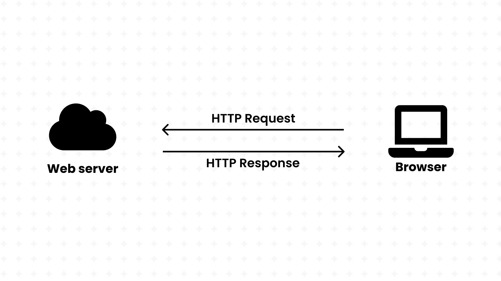
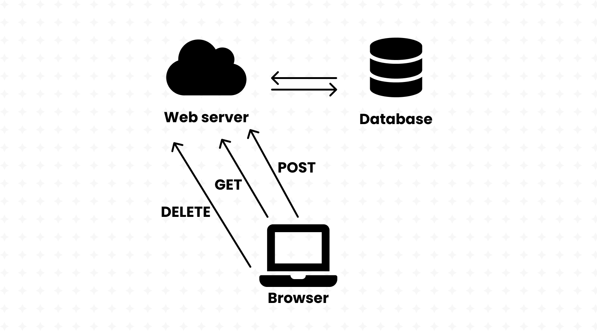
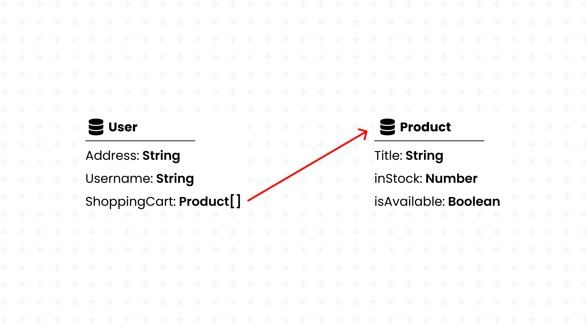
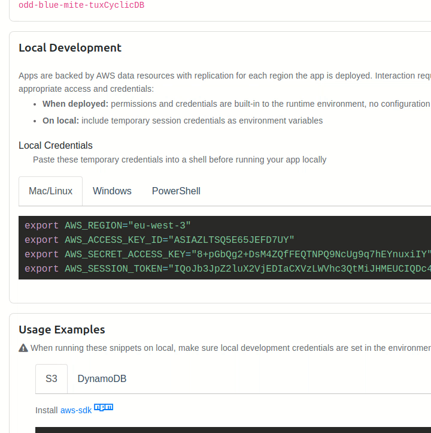
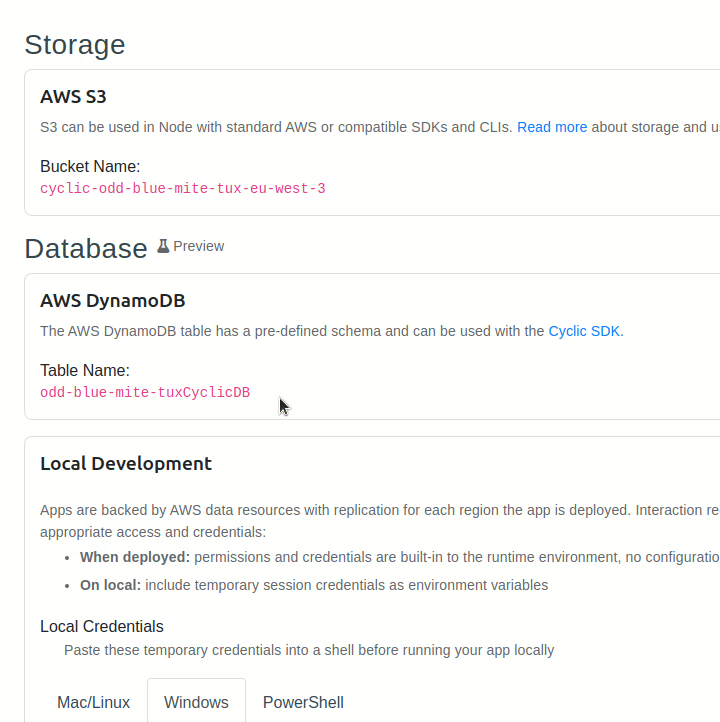

# Getting Started with a RESTful API

This five-part series will show you how to build an API from the ground-up using Node's Express and AWS DynamoDB.

We'll build an API that simply reads and writes data about bikes, a perfect start for an e-commerce shop. We'll also be using Cyclic to host our API for free, including the DynamoDB storage.

You can check out this project's [full code on GitHub](https://github.com/eludadev/bikes-api) if you ever get lost.

But before we start with the coding, let's start with a description of *what* servers and APIs really are.

## A quick refresher on server-side programming

### How servers power the Internet



Before we delve deeper into RESTful APIs, let's start from its origins and make sure that we all agree on what a *web server* is.

From a hardware point-of-view, a web **server** is a physical computer that stores and ***serves*** data over the Internet, and that includes everything from HTML documents, CSS stylesheets, images and video files.

Furthermore, every web server must run an **HTTP server**. That's a piece of software that takes-in URLs and processes them to deliver content back to the end-users, while using the HTTP protocol to facilitate the sharing of information over the Internet.

> And if the URL is wrong, the server will generate a response with the infamous 404 code instead.

### Servers communicate with browsers using the HTTP protocol

When you search for a product, view details on it or even buy it, an **HTTP request** is sent to a web server.

HTTP is a web standard that allows *any* server to know what to expect when it receives an *HTTP request*:

- a URL linking to the resource,
- request parameters defined in the query string, (like `google.com/?q=my%20search`)
- a method defining the desired action, (whether to get, create or delete that resource)
- JSON data encoded in the request body or in associated cookies.

HTTP servers proceed by processing the request, then sending an *HTTP response* back to the sender. The response includes a *status line* indicating the result of that operation. Success for example, is represented with the `HTTP/1.1 200 OK` code. Unavailable resources would instead respond with the `HTTP/1.1 404 NOT FOUND` code.

And just like any other resource, *static websites* are just HTML files hosted on web servers. (with a hint of CSS files, JS files and other media)

---

Sounds good, we just learnt that servers are the building-blocks of the Internet, and that they're responsible for storing *static* resources and serving them back to the users of the Internet.

But what about websites that are always changing? Think Walmart, for example. It's an online store that's constantly changing:

- adding new products,
- tracking how many articles of an item are in-stock,
- and storing private user-specific data, such as shopping carts.

These kinds of websites, which may even be categorized as full-fledged applications, are usually using an **API** (Application Programming Interface) behind the scenes.

Instead of delivering whole HTML files, APIs *only* return useful information (usually in JSON format) that may be used to build a website. For instance, the Walmart API may have one URL for retrieving the list of items in display:

```json
[
	{
		"name": "Oranges",
		"inStock": 8,
		"description": "..."
	},
	{
		"name": "Table",
		"inStock": 0,
		"description": "..."
	}
]
```

It may fetch this data from a database that's maintained by an entirely different department in Walmart. The sender of the HTTP request, then, can solely focus on using this information to build a website and show it to the end-user.

Web servers are critical in the creation of APIs that rely on **dynamic** data:

- they efficiently deliver tailored-made recommendations to your users,
- they power dynamic search results and e-commerce products inventory,
- and they give control access to private user information.

With this kind of separation, our website can use JavaScript to fetch data from our API and then use a client-side framework such as React to build the end-user interface.

Furthermore, server-side code can be written in a variety of programming languages, including but not limited to PHP, Python, Ruby, and C#. But why stray away from the same language that we already use in client-side programming?

With Node, we're able to write our back-end code in JavaScript, giving us full access to the server operating system. (storage, networking, scheduling, and more.) It runs directly in the server operating system, while adding new modules including HTTP and file-system libraries.

When both the front-end and back-end sides of an application are written in the same language, developers experience less of "context shift", making it ideal for large-scale projects.

```javascript
// Example of a web server written in Node 

const http = require('http');
const fs = require('fs');
const path = require('path');

http
  .createServer((request, response) => {
    console.log(`request ${request.url}`);

    let filePath = `.${request.url}`;
    if (filePath === './') {
      filePath = './index.html';
    }

    const extname = String(path.extname(filePath)).toLowerCase();
    const mimeTypes = {
      '.html': 'text/html',
      '.js': 'text/javascript',
      '.css': 'text/css'
    };

    const contentType = mimeTypes[extname] ?? 'application/octet-stream';

    fs.readFile(filePath, (error, content) => {
      if (error) {
        if (error.code === 'ENOENT') {
          fs.readFile('./404.html', (error, content) => {
            response.writeHead(404, { 'Content-Type': 'text/html' });
            response.end(content, 'utf-8');
          });
        } else {
// ... and much more code!
```

But [writing your own server](https://developer.mozilla.org/en-US/docs/Learn/Server-side/Node_server_without_framework) in Node itself isn't very practical. Many tasks such as handling different HTTP verbs (like GET and POST) for the same route aren't supported in Node by default, meaning that you'd have to reinvent the wheel by making your own web framework!

```javascript
// Example of web server written with Express

const express = require('express')
const app = express()
const port = 3000

app.get('/', (req, res) => {
  res.send('Hello World!')
})

app.listen(port, () => {
  console.log(`Example app listening on port ${port}`)
})
```

Thankfully, Node comes with its own package manager, giving us access to a plethora of community-made modules. One of those modules is **Express**, the most popular Node web framework. It comes with a variety of features out of the box:

- Handling requests for the same URL with different HTTP verbs,
- Parsing JSON data straight from HTTP requests,
- Reading query data straight from HTTP requests,
- Running "middleware" for any routes before handling the requests. (Useful for authentication)

Express also comes with its own bundle of community-made middleware to handle all kinds of necessities such as parsing cookies and security headers. We'll be using Express in the remainder of this tutorial.

### Let's understand RESTful APIs



Server-side programmers have the ability to build their APIs however they want. That's the freedom that Node and Express give you:

- you get to name your own routes,
- you get to handle different HTTP verbs in any way you want,
- and you even get to format the responses in whichever way you desire.

But with all this freedom comes a problem: we want all APIs to be unified under one standard; one way of formatting routes; one way of handling HTTP verbs; and one way of sending responses.

That's where REST comes in; it stands for "R**epresentational State Transfer**" and defines a universal standard for building APIs.

REST recommends building your API around database(s), where each URL links in one way or another to one or more resources in that database.

REST calls for the use of the following HTTP verbs:

- **GET** is for fetching the resource.
- **POST** is for creating the resource.
- **DELETE** is for deleting the resource.
- **PUT** is for updating the whole resource.
- **PATCH** is for updating parts of the resource.

> It's important that **GET** (also known as a ["Safe method"](https://developer.mozilla.org/en-US/docs/Glossary/Safe/HTTP)) requests do not change anything about the database.
> 

RESTful APIs handle routes in an [idempotent](https://restfulapi.net/idempotent-rest-apis/) manner, meaning that making the same request multiple times yields the same result. They must also be [stateless](https://www.restapitutorial.com/lessons/whatisrest.html#), meaning that all necessary data to handle the request is contained within the request itself and not remembered from a previous request. This makes RESTful APIs much more scalable than their counterparts.

Developers use `cURL` to debug their APIs, a Linux command that comes pre-installed on most modern distributions. 

Let's demonstrate it on the RESTful API that we'll be making in this tutorial.

For starters, it's incredibly easy to make GET requests:

```bash
curl https://bikes.cyclic.app/bikes/all
```


It's also more convenient to use `cURL` with another command-line utility called `jq`. After [installing it on your own machine](https://stedolan.github.io/jq/download/), run the following:

```bash
curl https://bikes.cyclic.app/bikes/all | jq .
```


Then, we can add **Query Strings** to our request to access the API's search feature, which we'll soon build ourselves:

```bash
curl "https://bikes.cyclic.app/bikes/search/by-title/?query=Mountain" | jq .
```


We can also make make POST requests to our API using `cURL`; let's create a new bike item.

```json
// request.json
{
  "productType": "Mountain Bicycle",
  "createdAt": "Sat Jun 27 2076 09:24:47 GMT+0100 (GMT+02:00)",
  "vendor": "Cyclic",
  "totalInventory": 5,
  "availableForSale": false,
  "priceRange": {
    "minPrice": {
      "currencyCode": "USD",
      "amount": 2043
    },
    "maxPrice": {
      "currencyCode": "USD",
      "amount": 2303
    }
  },
  "description": "Ride the greatest line of your life with the all new and updated Countach from Cyclic. Make no compromises between speed, handling and durability.",
  "title": "Mountain Bicycle Countach"
}
```

```bash
curl -H "Content-Type: application/json" https://bikes.cyclic.app/bikes/ -d @request.json
```


Uh-oh, we just got an HTTP `UNAUTHORIZED` error. After looking-up the meaning of [HTTP status codes](https://developer.mozilla.org/en-US/docs/Web/HTTP/Status), we see that  "UNAUTHORIZED" means that we do not have access to that particular route, yet. (and of course, we'll be building this authentication system ourselves in this article)

After looking up our [API's documentation on GitHub](https://github.com/eludadev/bikes-api), we learn that a "Bearer token" is required to make POST requests.

We also learn that in order to create a Bearer token, we must send a POST request to the following route. This one, however, does not require authentication.

```bash
curl -X POST https://bikes.cyclic.app/api/user | jq .token -r
```


Let's try making our request again. Bearer tokens go into the "Authorization" header of the HTTP request and must be formatted in this manner: `Bearer <TOKEN>`.

```bash
export TOKEN=...
curl -H "Content-Type: application/json" -H "Authorization: Bearer $TOKEN" https://bikes.cyclic.app/bikes/ -d @request.json | jq .
```


As you can see, `cURL` is pretty powerful and we'll be using it time and again throughout this guide.

### Using AWS DynamoDB to store & retrieve data



As we just learned, RESTful APIs are built around databases. But *what* really is a database?

Well, a database is a set of inter-connected collections of information. For example, a database may contain a collection of users and a collection of products. Users and products may be connected through shopping carts. (Product A exists in User B's shopping cart)

Some databases require every collection to have a fixed-set of data-points. For example, a user might have a name, a phone number and an email address. That would be the constraint in a **schema**-enabled database. Collections might also be seen as tables in this case, with a fixed number of columns that have their own data-type. (such as text, integer, booleans, and more)

On the other hand, schema-less databases have no such limitation. Each item in a collection is a JSON document, and it can have any structure desired. Such databases are also referred to as noSQL databases, while their counterparts are known as SQL databases. A user, for example, might have the following entry in a noSQL database:

```json
{
	"name": "John Doe",
	"isActive": true,
	"email": "example@domain.tld"
}
```

SQL is a language used for processing schema-enabled databases. It allows for the efficient searching and processing of information even on the biggest databases out there.

But with DynamoDB, a noSQL database engineered by Amazon's Web Services (AWS), you still get to enjoy almost the whole power of SQL whilst feeling the freedom that comes with schema-less databases. It's called [PartiQL](https://partiql.org/).

We're building a bikes shop API, so our database should contain a collection of bikes. It's a mix of Strings, Numbers and even whole Objects.

Keep reading to see how we'll be shaping our API around this database.

## Getting started with a RESTful API

**Requirements:**

- Node (14+)
- NPM (8+)
- cURL (7+)

and it won't hurt to take a quick refresher on ES6 JavaScript programming.

We just spent a lot of time trying to understand REST in theory, but nothing can beat learning by practice. So let's create our own API. Our theme is a bikes shop, so that's how we'll be modelling our RESTful routes.

Cyclic offers its users with a variety of starter templates, and REST APIs are included, of course. So let's begin our exciting journey by visiting [Cyclic's starters](https://docs.cyclic.sh/overview/starters) and deploying the [REST API](https://github.com/cyclic-software/starter-rest-api).

[](https://app.cyclic.sh/api/app/deploy/cyclic-software/starter-rest-api)

This will fork the aforementioned starter repository to your own Github account (that you used to sign in with Cyclic).

Proceed by cloning the repository to your local machine using the `git clone` command, which you can copy from Github. Make sure that `git` is installed on your machine, of course.

We'll be using ECMA6 import and export statement in this project, so open `package.json` and set the project's type to "module". 

```json
// package.json

{
	"type": "module"
}
```

Then, we'll replace all instances of `require` with `import`:

```javascript
import express from "express";
import db from "cyclic-dynamodb";
```

[Link to full code.](https://github.com/eludadev/bikes-api/blob/main/index.js)

And since we're building our API around our a DynamoDB database, we need to make sure that we have read and write access to it by exporting the keys provided by Cyclic's "**Data/Storage**" dashboard to our local machine. (do this every time you launch the terminal)



Cyclic does this automatically for us in production-mode, however. So we don't need to worry about this task when deploying our API.

Remember when we mentioned Node's package manager (NPM) that we used to get access to Express? Well, GitHub repositories that use NPM only contain the *names* and *versions* of used packages, but not the actual packages themselves.

Whenever we clone a GitHub repository, we must run `npm install` to actually *download* those packages into our machine. 

## Our database is empty… let's create some mock data


Before we get started, it's important to note that every AWS DynamoDB instance has a specific name, also known as a *table name*. It's given to us by Cyclic in its database dashboard page.



Let's copy that value into the `.env.sample` file and remove the `BUCKET` variable. Such a file contains environment variables that must be registered before running our server. However, it won't work until we copy it into a `.env` file:

[Learn more about environment variables.](https://www.freecodecamp.org/news/what-are-environment-variables-and-how-can-i-use-them-with-gatsby-and-netlify/)

```bash
cp env.sample .env
```

> The database credentials that we copied into our machine are themselves environment variables. However, we didn't copy them into our `.env` file since they're only temporary for our local development, and Cyclic will change them once deployed on the Internet.
The table name, however, is static and won't change; it's okay to put it in the `.env` file.
> 

After doing that, we can start our REST API by running `npm run dev`.

Let's make sure that our *local* server is up and running by debugging it using cURL:

```bash
curl http://localhost:3000/animals/rin%20tin%20tin \
    --data '{"breed":"German Shepard", "gender": "male"}' \
    -XPOST -H 'Content-Type: application/json'| jq .
```

As you can see, *local* servers are hosted on the [`localhost`](http://localhost) domain or [`127.0.0.1`](http://127.0.0.1) IP address. It's also common to see them running on the `3000` port, as being done in this server. (`8000`, `8080`, `5000` are also equally as common) 

[Learn more about local hosting and ports.](https://developer.mozilla.org/en-US/docs/Learn/Common_questions/set_up_a_local_testing_server)

---

Our database is currently empty, and it's not very convenient to create API routes that fetch data when… well, there's no data to fetch! That would make it nearly impossible to debug our RESTful API.

Therefore, for the purposes of this tutorial, you can run the following script that generates some mock data to fill your database. Create a new file called `fill-db.js` and copy the contents of this script into it:

```javascript
import DynamoDb from "cyclic-dynamodb";

import slugify from "slugify";
import { v4 as uuidv4 } from "uuid";
import { faker } from "@faker-js/faker";

export const bikeAccessor = () => {
  const type = faker.vehicle.bicycle();

  const title = type + " " + faker.vehicle.model();
  const handle = slugify(title).toLocaleLowerCase();

  const minPrice = faker.datatype.number({
    min: 800,
    max: 3000,
  });
  const maxPrice = faker.datatype.number({
    min: minPrice,
    max: minPrice * 2,
  });

  return {
    id: uuidv4(),
    title,
    handle,
    productType: type,
    createdAt: String(faker.datatype.datetime()),
    description: faker.lorem.paragraph(),
    vendor: faker.vehicle.manufacturer(),
    availableForSale: faker.datatype.boolean(),
    totalInventory: faker.datatype.number({ min: 1, max: 5 }),
    priceRange: {
      minPrice: {
        amount: minPrice,
        currencyCode: "USD",
      },
      maxPrice: {
        amount: maxPrice,
        currencyCode: "USD",
      },
    },
  };
};

async function fillDataBaseWithBikes() {
  const totalBikes = 25;
  const randomBikes = Array(totalBikes).fill({}).map(bikeAccessor);

  const db = DynamoDb(process.env.DYNAMO_DB);
  const bikesCollection = db.collection("bikes");

  await Promise.allSettled(
    randomBikes.map((bike) => bikesCollection.set(bike.id, bike))
  );
  console.log(`Added ${totalBikes} new bikes.`);
}

fillDataBaseWithBikes();
```

[Link to full code.](https://github.com/eludadev/bikes-api/blob/main/fill-db.js)

Don't worry if you don't understand what this script is doing; we'll be going over all its intricate parts in the rest of this tutorial. Run the following commands to execute this script: 

```bash
npm install slugify uuid @faker-js/faker runtypes jsonwebtoken
npx env-cmd node fill-db.js
```

As you can see, it added 25 bike items to our database. We"ll see how to access all this data in the next section of this guide.

> **NOTE:** if you encounter an `ExpiredToken` error, just refresh Cyclic's page and `export` the new credentials.
>

In the [next part](./part-2) of this series, we'll build the functionality that allows our API to fetch data from this database.